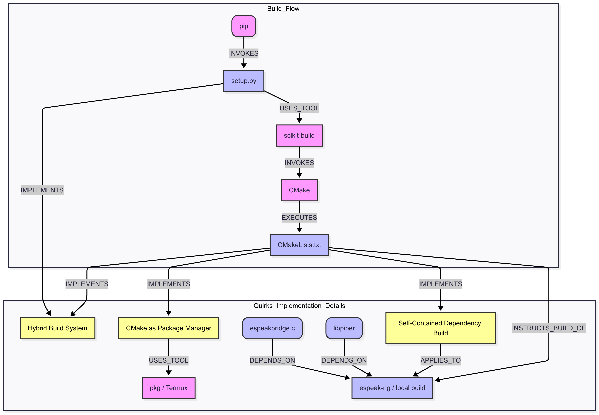

A fast and local neural text-to-speech engine that embeds [espeak-ng][] for phonemization.

This fork extends Piper's reach by providing a streamlined, robust build process specifically for Termux (Android), making it easily installable via `pip install .` and thus more universally accessible across various platforms.

Install with:

``` sh
pip install piper-tts
```

* 🎧 [Samples][samples]
* 💡 [Demo][demo]
* 🗣️ [Voices][voices]
* 🖥️ [Command-line interface][cli]
* 🌐 [Web server][api-http]
* 🐍 [Python API][api-python]
* 🔧 [C/C++ API][libpiper]
* 🏋️ [Training new voices][training]
* 🛠️ [Building manually][building]

---

## 🚀 Quick Start (Recommended Method)

### Prerequisites

Ensure you have the necessary build tools installed:

```bash
pkg update && pkg install build-essential cmake git ninja-build
```

### Installation

With the prerequisites in place, you can install the `piper-tts` package directly from this repository:

```bash
pip install .
```

This single command handles the download, compilation, and installation of all dependencies. For detailed build information, see the [docs/BUILDING.md](docs/BUILDING.md) file.

**The original, manual build guide and usage examples are preserved below for reference.**

---

People/projects using Piper:

* [Home Assistant](https://github.com/home-assistant/addons/blob/master/piper/README.md)
* [NVDA - NonVisual Desktop Access](https://www.nvaccess.org/post/in-process-8th-may-2023/#voices)
* [Image Captioning for the Visually Impaired and Blind: A Recipe for Low-Resource Languages](https://www.techrxiv.org/articles/preprint/Image_Captioning_for_the_Visually_Impaired_and_Blind_A_Recipe_for_Low-Resource_Languages/22133894)
* [Video tutorial by Thorsten Müller](https://youtu.be/rjq5eZoWWSo)
* [Open Voice Operating System](https://github.com/OpenVoiceOS/ovos-tts-plugin-piper)
* [JetsonGPT](https://github.com/shahizat/jetsonGPT)
* [LocalAI](https://github.com/go-skynet/LocalAI)
* [Lernstick EDU / EXAM: reading clipboard content aloud with language detection](https://lernstick.ch/)
* [Natural Speech - A plugin for Runelite, an OSRS Client](https://github.com/phyce/rl-natural-speech)
* [mintPiper](https://github.com/evuraan/mintPiper)
* [Vim-Piper](https://github.com/wolandark/vim-piper)
* [POTaTOS](https://www.youtube.com/watch?v=Dz95q6XYjwY)
* [Narration Studio](https://github.com/phyce/Narration-Studio)
* [Basic TTS](https://basictts.com/) - Simple online text-to-speech converter.

[](https://www.openhomefoundation.org/)

---

## 🗣️ Usage

Once the package is installed, you can use Piper from the command line.

First, download a voice model if you haven't already:
```bash
python3 -m piper.download_voices
```

### Command Line Options

```
Usage:
  python3 -m piper [OPTIONS] [-- TEXT]
  echo "TEXT" | python3 -m piper [OPTIONS]

Description:
  piper is a lightweight text-to-speech (TTS) command-line interface
  for Termux using Piper and eSpeak-ng.

Options:
  -m, --model MODEL_NAME
        Name of the ONNX voice model to use (without .onnx extension).
        This option is required.

  -f, --file OUTPUT_FILE
        Write synthesized audio to the given file (RAW format).
        Default: 'output.raw' if this option is used without a file name.

  --output-raw -
        Write audio output to standard output (stdout).
        This allows piping to audio players like 'play' or 'aplay'.

  -- TEXT
        Input text to synthesize. If not provided, text will be read from stdin.
```

### Examples

1.  **Read text from clipboard and play output (requires `sox` package):**

    ```bash
    termux-clipboard-get | python3 -m piper --model en_US-lessac-medium --output-raw | play -t raw -r 22050 -e signed-integer -b 16 -c 1 -
    ```

2.  **Write audio to a file:**

    ```bash
    python3 -m piper -m fa_IR-gyro-medium -f output.raw -- "سلام دنیا"
    ```

3.  **Use default output file (output.raw) with stdin:**

    ```bash
    echo "Hello world" | python3 -m piper -m en_US-mlm -f
    ```

### Environment Variables

The `piper` command-line interface and Python API can be configured with the following environment variables:

| Variable | Description |
|---|---|
| `PIPER_VOICE_PATH` | Path to the directory containing your downloaded voice models (.onnx and .onnx.json files). If not set, Piper will search in the current directory. |
| `ESPEAK_DATA_PATH` | Path to the `espeak-ng-data` directory. This is usually handled automatically if `espeak-ng` is installed correctly via `pkg`. You only need to set this if you are using a custom location for the espeak data. |

### Notes

- Output is always in 32-bit float RAW format at 22050Hz, mono.
- When using `--output-raw -`, the output can be piped directly to 'play' or other audio tools.
- This CLI is designed for use within Termux and supports local model/data directories.

## 🛠️ Building from Source & Development

For detailed instructions on building from source, setting up a development environment, or troubleshooting the build process, please refer to our comprehensive guide:

*   **[📄 docs/BUILDING.md](docs/BUILDING.md)**



This document provides a deep dive into the build architecture, including the automated `CMake` process and manual verification steps.
 

<!-- Links -->
[espeak-ng]: https://github.com/espeak-ng/espeak-ng
[cli]: https://github.com/OHF-Voice/piper1-gpl/blob/main/docs/CLI.md
[api-http]: https://github.com/OHF-Voice/piper1-gpl/blob/main/docs/API_HTTP.md
[api-python]: https://github.com/OHF-Voice/piper1-gpl/blob/main/docs/API_PYTHON.md
[training]: https://github.com/OHF-Voice/piper1-gpl/blob/main/docs/TRAINING.md
[building]: https://github.com/OHF-Voice/piper1-gpl/blob/main/docs/BUILDING.md
[voices]: https://github.com/OHF-Voice/piper1-gpl/blob/main/docs/VOICES.md
[samples]: https://rhasspy.github.io/piper-samples
[demo]: https://rhasspy.github.io/piper-samples/demo.html
[libpiper]: https://github.com/OHF-Voice/piper1-gpl/tree/main/libpiper
 
